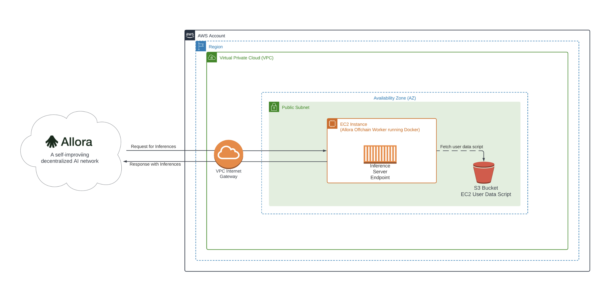

# Sample AWS Blockchain Node Runner app for Allora Worker Nodes

| Contributed by |
|:--------------------:|
| [@clementupshot](https://github.com/clementupshot), [@allora-rc](https://github.com/allora-rc) |

[Allora](https://www.allora.network/) is a self-improving decentralized Artificial Intelligence (AI) network. The primary goal of the network is to be the marketplace for intelligence. In other words, Allora aims to incentivize data scientists (workers) to provide high-quality inferences as requested by consumers. Inferences include predictions of arbitrary future events or difficult computations requiring specialized knowledge.

The Allora Network brings together

  - [Consumers](https://docs.allora.network/devs) who pay for and acquire inferences or expertise to be revealed
  - [Workers](https://v2.docs.allora.network/datasci) who reveal inferences
  - [Reputers](https://docs.allora.network/nops) who determine how accurate workers are after a ground truth is revealed
  - [Validators](https://docs.allora.network/nops) who secure protocol state, history, and reward distributions

With these ingredients, the Allora Network is able to continuously learn and improve itself over time producing inferences that are more accurate than the most accurate participant.

Allora Worker nodes are the interfaces between data scientists' models and the Allora Network. A worker node is a machine-intelligent application registered on the Allora chain that provides inference/prediction on a particular topic it's subscribed to and gets rewarded based on the inference quality.

This blueprint is designed to assist in deploying a single Allora [Worker Node](https://v2.docs.allora.network/datasci) on AWS. It is intended for use in development, testing, or Proof of Concept (PoC) environments.

## Overview of Deployment Architecture

### Single Worker Node Setup


## Worker Node System Requirements

- Operating System: Any modern Linux operating system
- CPU: Minimum of 1/2 core
- Memory: 2 to 4 GB
- Storage: SSD or NVMe with at least 5GB of space

## Additional materials

<details>

<summary>Well-Architected Checklist</summary>


This is the Well-Architected checklist for Allora Worker Nodes implementation of the AWS Blockchain Node Runner app. This checklist takes into account questions from the [AWS Well-Architected Framework](https://aws.amazon.com/architecture/well-architected/) which are relevant to this workload. Please feel free to add more checks from the framework if required for your workload.

| Pillar                  | Control                           | Question/Check                                                                   | Remarks          |
|:------------------------|:----------------------------------|:---------------------------------------------------------------------------------|:-----------------|
| Security                | Network protection                | Are there unnecessary open ports in security groups?                             |    |
|                         |                                   | Traffic inspection                                                               | AWS WAF could be implemented for traffic inspection. Additional charges will apply.  |
|                         | Compute protection                | Reduce attack surface                                                            | This solution uses Canonical, Ubuntu, 24.04 LTS. You may choose to run hardening scripts on it.  |
|                         |                                   | Enable people to perform actions at a distance                                   | This solution uses AWS Systems Manager for terminal session, not ssh ports.  |
|                         | Data protection at rest           | Use encrypted Amazon Elastic Block Store (Amazon EBS) volumes                    | This solution uses encrypted Amazon EBS volumes.  |
|                         | Data protection in transit        | Use TLS                                                                          |  |
|                         | Authorization and access control  | Use instance profile with Amazon Elastic Compute Cloud (Amazon EC2) instances    | This solution uses AWS Identity and Access Management (AWS IAM) role instead of IAM user.  |
|                         |                                   | Following principle of least privilege access                                    | In the node, root user is not used (using special user "ubuntu" instead).  |
|                         | Application security              | Security focused development practices                                           | cdk-nag is being used with documented suppressions.  |
| Cost optimization       | Service selection                 | Use cost effective resources                                                     |  |
|                         | Cost awareness                    | Estimate costs                                                                   |  |
| Reliability             | Resiliency implementation         | Withstand component failures                                                     | This solution currently does not have high availability and is deployed to a single availability zone.  |
|                         | Data backup                       | How is data backed up?                                                           | The data is not specially backed up. The node will have to re-sync its state from other nodes in the Allora network to recover.  |
|                         | Resource monitoring               | How are workload resources monitored?                                            |   |
| Performance efficiency  | Compute selection                 | How is compute solution selected?                                                |   |
|                         | Storage selection                 | How is storage solution selected?                                                |   |
|                         | Architecture selection            | How is the best performance architecture selected?                               |   |
| Operational excellence  | Workload health                   | How is health of workload determined?                                            |   |
| Sustainability          | Hardware & services               | Select most efficient hardware for your workload                                 |   |
</details>
<details>

<summary>Recommended Infrastructure</summary>


| Usage pattern                                     | Ideal configuration                                                                                                      | Primary option on AWS                                                  | Config reference                                      |
|---------------------------------------------------|--------------------------------------------------------------------------------------------------------------------------|------------------------------------------------------------------------|-------------------------------------------------------|
| 1/ Fullnode                                       | 8 vCPU, 32 GB RAM, Data volume: EBS gp3 2TB, 7K IOPS, 400 MB/s throughput | `m6a.2xlarge` EBS gp3 volumes about 2000 GB(7000 IOPS, 400 MBps/s throughput) | [.env-sample-full](./sample-configs/.env-sample-full) |
</details>

## Setup Instructions

### Setup Cloud9

We will use AWS Cloud9 to execute the subsequent commands. Follow the instructions in [Cloud9 Setup](../../docs/setup-cloud9.md).

### Clone this repository and install dependencies

```bash
   git clone https://github.com/aws-samples/aws-blockchain-node-runners.git
   cd aws-blockchain-node-runners
   npm install
```

### Deploy Single Worker Node

1. Make sure you are in the root directory of the cloned repository

2. Configure your setup

    Create your own copy of `.env` file and edit it to update with your AWS Account ID and Region:
    ```bash
   # Make sure you are in aws-blockchain-node-runners/lib/allora
   cd lib/allora
   npm install
   pwd
   cp ./sample-configs/.env-sample-full .env
   nano .env
    ```
   > NOTE:
   > Example configuration parameters are set in the local `.env-sample` file. You can find more examples inside `sample-configs` directory.

3. Deploy common components such as IAM role

   ```bash
   pwd
   # Make sure you are in aws-blockchain-node-runners/lib/allora
   npx cdk deploy allora-common
   ```

   > IMPORTANT:
   > All AWS CDK v2 deployments use dedicated AWS resources to hold data during deployment. Therefore, your AWS account and Region must be [bootstrapped](https://docs.aws.amazon.com/cdk/v2/guide/bootstrapping.html) to create these resources before you can deploy. If you haven't already bootstrapped, issue the following command:
   > ```bash
   > cdk bootstrap aws://ACCOUNT-NUMBER/REGION
   > ```


4. Deploy Allora Worker Node

   ```bash
   pwd
   # Make sure you are in aws-blockchain-node-runners/lib/allora
   npx cdk deploy allora-single-node --json --outputs-file single-node-deploy.json
   ```
